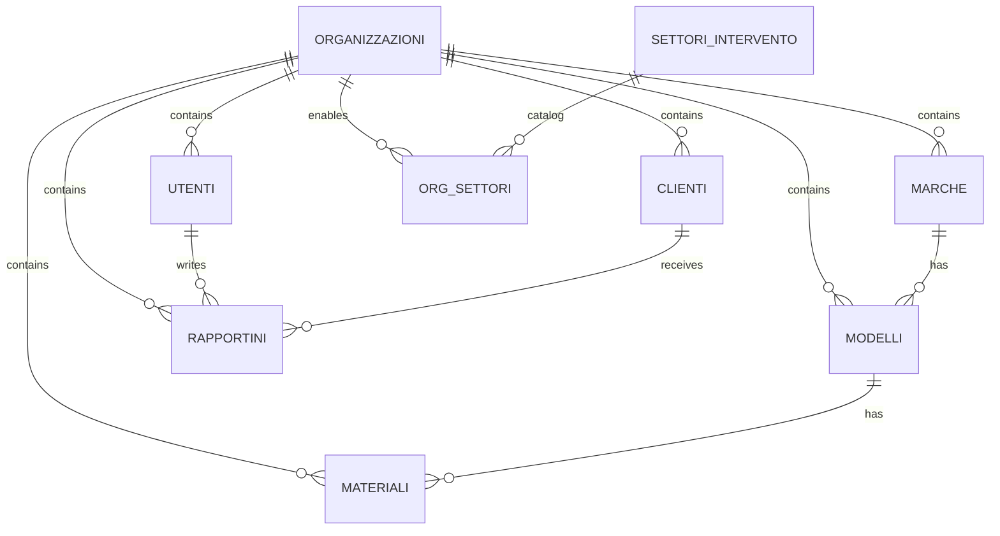

# Guida Database (come funziona)

Questa guida spiega **come funziona il database** del progetto `mistral-rapportini`, quali sono le tabelle principali, come viene gestito il multi-tenant e dove avviene il controllo accessi.

## 1) Architettura in breve

- Database: **PostgreSQL su Supabase**.
- Accesso dati: API Next.js (`app/api/**`) tramite client Supabase server.
- Autenticazione: JWT custom (`access_token` + `refresh_token`) con claim `userId`, `ruolo`, `org_id`.
- Multi-tenant: separazione dati per organizzazione con campo tenant:
  - versione legacy: `idsocieta`
  - versione target/attuale consigliata: `org_id`

## 2) Modelli di schema presenti nel repository

Nel repo convivono due “famiglie” di schema:

### A. Schema legacy/evolutivo
Script principali:
- `supabase/schema.sql`
- `supabase/materiali_schema.sql`
- `supabase/MODULI_INTERVENTI_SCADENZE.sql`
- `supabase/ALTER_IDSOCIETA.sql`
- `supabase/ALTER_TABELLE.sql`

Caratteristiche:
- nasce con tabelle base (`utenti`, `clienti`, `rapportini`) e poi evolve;
- inizialmente usa `idsocieta`, poi varie parti sono migrate a `org_id`;
- RLS spesso permissiva (`USING (true)`), con controllo principale lato API.

### B. Schema condiviso multi-tenant (target consigliato)
Script principali:
- `supabase/RESET_SHARED_DB_ORG_ID.sql` (reset + schema completo multi-tenant)
- `supabase/RESET_MISTRAL_ORG_ID.sql` (seed tenant `mistral`)

Caratteristiche:
- schema coerente su `org_id`;
- tabelle organizzative (`organizzazioni`, `settori_intervento`, `org_settori`);
- policy RLS più restrittive e centrate su `current_org_id()` + ruolo utente.

## 3) Tabelle principali e relazioni

### 3.1 Core business
- `utenti` (operatori/admin)
  - PK: `id`
  - campi chiave: `org_id`, `username`, `ruolo`, `attivo`
  - unique tenant-aware: `(org_id, username)`
- `clienti`
  - PK: `id`
  - appartenenza tenant via `org_id`
- `rapportini`
  - PK: `id`
  - FK: `utente_id -> utenti.id`
  - FK: `cliente_id -> clienti.id`
  - tenant: `org_id`

### 3.2 Catalogo tecnico
- `marche`
- `modelli` (FK `marca_id`)
- `materiali` (FK `modello_id`)

Tutte tenant-aware (`org_id`) nello schema target.

### 3.3 Moduli aggiuntivi
- `interventi_programmati`
- `scadenze_compliance`

Sono tabelle indipendenti (senza FK verso `clienti/utenti`) e filtrate per `org_id`.

### 3.4 Entità organizzative (schema target)
- `organizzazioni`
- `settori_intervento`
- `org_settori`

Servono a modellare tenant e settori abilitati per ogni org.

## 4) Diagramma logico (schema target)

## 5) Come funziona la sicurezza dati

### 5.1 Controllo a livello API
- Il `middleware.ts` valida JWT e inietta header:
  - `x-user-id`
  - `x-user-ruolo`
  - `x-org-id`
- Le API filtrano le query per `org_id` e, per operatore, per `utente_id` quando necessario.
- Esempio: su `rapportini` un operatore vede solo i propri record; admin vede tutti i record della stessa org.

### 5.2 RLS su Supabase
- Le tabelle hanno RLS abilitata.
- Nel modello target (`RESET_SHARED_DB_ORG_ID.sql`) le policy usano:
  - `current_org_id()`
  - `is_admin()`
  - claim JWT (`userId`, `ruolo`, `org_id`)

### Nota importante
Se il backend usa `SUPABASE_SERVICE_ROLE_KEY`, la RLS viene bypassata per quelle query.
Nel codice corrente il client server (`lib/supabase-server.ts`) usa service role se disponibile.
Quindi oggi il vero enforcement è **combinato**:
- filtro applicativo lato API +
- RLS (effettiva solo dove non si usa service role).

## 6) Flussi principali (operativi)

### 6.1 Login
1. `POST /api/auth/login`
2. lookup utente in `utenti` filtrando `org_id`
3. verifica password (bcrypt o plaintext legacy)
4. update `ultimo_accesso`
5. emissione JWT con `org_id`

### 6.2 Creazione rapportino
1. validazione payload
2. verifica utente (`utenti`)
3. ricerca/creazione cliente (`clienti`) nella stessa `org_id`
4. insert su `rapportini` con `utente_id`, `cliente_id`, `org_id`

### 6.3 Lettura rapportini
- filtro per `org_id`
- se ruolo operatore: filtro ulteriore `utente_id = utente corrente`
- supporto filtri data/marca/modello + paginazione.

## 7) Convenzioni e vincoli utili

- Trigger `updated_at` su molte tabelle.
- Vincoli univoci tenant-aware (es. username per org, cliente per org).
- Indici su campi di filtro principali (`org_id`, date, FK).
- In alcune parti legacy esiste compatibilità `idsocieta` -> `org_id`.

## 8) Setup consigliato per nuovi ambienti

Per nuovi ambienti, la sequenza più pulita è:

1. `supabase/RESET_SHARED_DB_ORG_ID.sql`
2. `supabase/RESET_MISTRAL_ORG_ID.sql`
3. (opzionale) script seed aggiuntivi del catalogo/moduli

Per ambienti storici già in produzione, usare gli script `ALTER_*` per migrazione progressiva.

## 9) Stato attuale del progetto (in pratica)

- Il codice applicativo è già orientato a `org_id`.
- Sono presenti fallback legacy (`idsocieta`) in alcuni punti per retrocompatibilità.
- Esiste documentazione di migrazione in `supabase/ADATTAMENTO_CODICE_MISTRAL_ORG_ID.md`.

## 10) Checklist rapida di salute database

- Tutte le tabelle operative hanno `org_id` valorizzato.
- Gli indici su `org_id` sono presenti.
- JWT include `org_id` e `ruolo`.
- Le API filtrano sempre per tenant.
- Le route sensibili non dipendono solo da controlli client-side.

---

Se vuoi, posso aggiungere una **seconda sezione operativa** con query SQL pronte (diagnostica tenant, integrità FK, utenti inattivi, rapportini orfani) per manutenzione ordinaria.